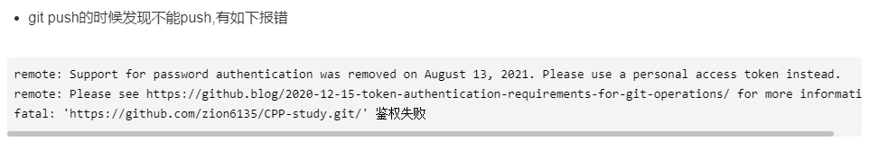
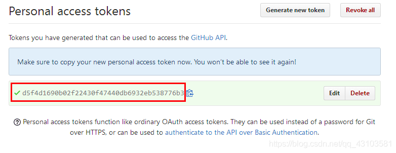
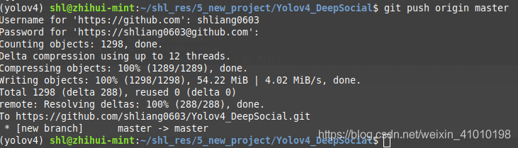
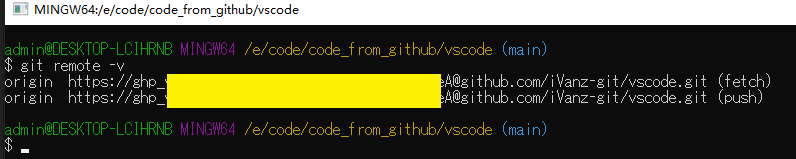

# <center>学习杂记
---
@author iVan
@date 20220824
## git通过token的方式进行push
源地址:[csdn](https://blog.csdn.net/m0_37844072/article/details/122715958)
https://blog.csdn.net/m0_37844072/article/details/122715958
- 问题描述：git push的时候发现不能push,有如下报错
- >

- 方案:
    - 1.生成token
    - 
    - 2.使用token，把生成的token当作密码，用户名是token的名字
    - 

设置完成后，$ git remote -v 可以确认是否已经替换【效果如下】：


---

## gitignore相关
### 1.当前我使用的gitignore配置如下：
```ignore
# java开发通用模版 ---iVanz---20220824
# 来自 https://blog.csdn.net/duguxueao/article/details/120334763

# Compiled class file
*.class

# Log file
*.log

# BlueJ files
*.ctxt

# Mobile Tools for Java (J2ME)
.mtj.tmp/

# Package Files #
*.jar
*.war
*.nar
*.ear
*.zip
*.tar.gz
*.rar

# virtual machine crash logs, see http://www.java.com/en/download/help/error_hotspot.xml
hs_err_pid*
replay_pid*

# ============================

# system ignore
.DS_Store
node_modules/

##uniapp
unpackage/

# Editor directories and files
.idea/
.vscode/
*.suo
*.ntvs*
*.njsproj
*.sln</code></pre> 
```
## 2.如果已经push到remote，如何使远程仓库更新.gitignore配置?
- gitignore只能忽略那些原来没有被track的文件，如果某些文件已经被纳入了版本管理中，则修改.gitignore是无效的。所以一定要养成在项目开始就创建.gitignore文件的习惯。
解决方法就是先把本地缓存删除(改变成未track状态)，然后再提交，按以下三步执行：
```git
git rm -r --cached .
git add .
git commit -m "msg"
```

## 3.如何定义全局的.gitignore文件?
- 除了可以在项目中定义.gitignore文件外，还可以设置全局的.gitignore文件来管理所有Git项目的行为。
这种方式在不同的项目开发者之间是不共享的，是属于项目之上Git应用级别的行为。
可以在任意目录下创建相应的.gitignore文件，然后再使用以下命令配置Git
```gitignore
git config --global core.excludesfile ~/.gitignore
```
---